# Simulador Pipeline MIPS

*Projeto de simulação de pipeline em processador MIPS*

**Disciplina:** Arquitetura de Computadores II.  
**Professor:** Rafael Leal Martins.   
**Autor:** Victor Hugo Resende Marinho.
-- -
### Visão Geral

O projeto do simulador pipeline MIPS, tem como objetivo executar o processo de pipelining de um processador MIPS em uma linguagem de alto nível para a visualização de comportamento das instruções de programas em diferentes estágios.

Neste projeto foi utilizado a linguagem Java, para o uso nativo de Programação Orientada a Objetos, de tal maneira que pudesse ser estruturado de forma organizada o código. E também foi utilizado arquivo de formato "txt" para leitura do programa exemplo em assembly.

Foram utilizados conceitos de tratamento de Hazards e predição de desvios para uma melhor eficiência do processo de Pipeline.

-- -
### Uso

Este projeto pode ser utilizado para fins didáticos, contribuindo com o entendimento do funcionamento de uma arquitetura MIPS com pipeline. Pode ser usado também para simulação visual dos processos contidos na execução de um código e também servindo para calcular número de ciclos que são utilizados em um dado programa.

-- -
### Diagrama UML

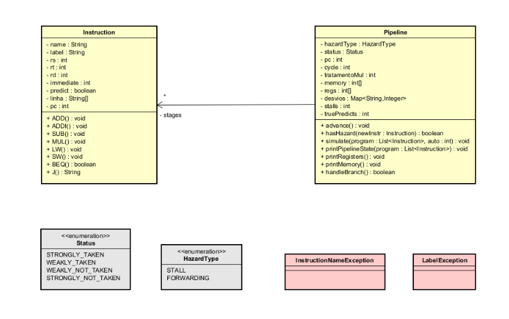

O projeto foi dividido em 2 principais classes que se comunicam:
- Instruction
- Pipeline

Contendo, respectivamente, os atributos e métodos necessários para as instruções e os atributos e métodos necessários para o funcionamento do Pipeline.

Para a estruturação lógica do programa e para o tratamento de exceções foram utilizadas também as classes:
- Status
- HazardType
- InstructionNameException
- LabelException

-- -
### Instruções Suportadas

1. `add $rd, $rs, $rt`(soma dois registradores)
2. `addi $rd, $rt, immediate`(soma 1 registrador e um valor imediato)
3. `sub $rd, $rs, $rt`
(subtrai dois registradores)
4. `mul $rd, $rs, $rt` (multiplica dois registradores)
5. `lw $rd, offset($rs)` (carrega da memória)
6. `sw $rt, offset($rs)` (armazena na memória)
7. `beq $rs, $rt, label` (branch if equal)
8. `j label` (jump incondicional)
9. `nop` (gera uma bolha forçada)

> **Observação:**  a instrução `mul` necessita de 2 ciclos na etapa de execução para finalizar.

-- -
### Funcionamento do Pipeline

O pipeline é administrado principalmente por um array de instruções com 5 posições (5 ciclos), sendo eles: **IF, ID, EX, MEM, WB**.

O controle do programa é feito a partir de um contador de programa *pc* que indica a posição atual do programa. Este programa é lido a partir de um arquivo com o nome *programa.txt* As instuções avançam para o próximo estágio à medida que essa dada etapa é liberada.

**Exemplo do estado Pipeline no terminal:**

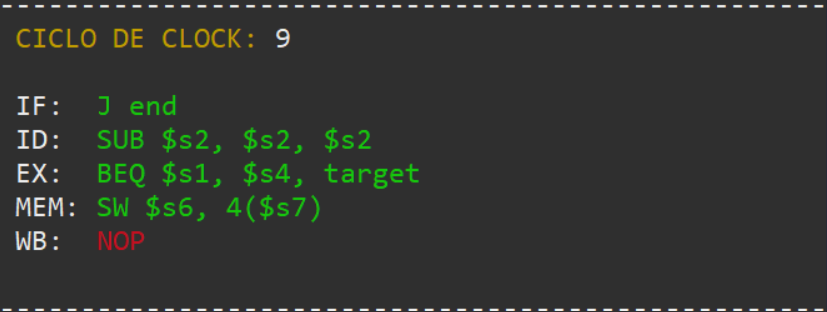

#### Estruturas de Dados utilizadas:

Foram utilizada estruturas como **Lista** para armazenar as instruções do programa. **Array** para armazenar as instruções nos 5 estágios do Pipeline, e também para representar a memória e registradores. **Map** para buscas fáceis e eficientes de label.
-- -
### Tratamento de Hazards

Para o tratamento de hazards, foram considerados dois tipos de soluções, no qual o usuário pode escolher qual deseja prosseguir:

- **STALLS:**

    Quando identificados hazards de dados ou estruturais, são adicionados bolhas (instrução NOP) ao pipeline até que seja liberado o registrador que esteja a causar conflito.
    
    Dessa maneira, antes de uma instrução passar para a fase de Fetch, é verificado se alguns dos seus registradores de entrada já está sendo considerado em alguma das instruções do Pipeline como registrador de destino. Caso isso esteja acontecendo, é inseridos bolhas até que esse registrador passe pelo estágio de Write Back.

- **FORWARDING:**

    No forwarding, os hazards são tratados de uma maneira diferente, onde o dado de um registrador de destino é passado diretamente do estágio de Execution para outro que passará para esse estágio no próximo ciclo. Ou então o dado é passado diretamente do estágio de Acesso à Memória para o Execution.

    Esse segundo caso ocorre quando temos uma instrução de `LW`, uma vez que o valor resultante é tido apenas ao ser acessado a memória. Então, para casos onde necessitamos do registrador de destino do `LW` em uma instrução que vem em seguida no programa, é necessário inserir uma bolha apenas, de forma que a instrução de Load esteja saindo da fase de **MEM** quando a próxima instrução tiver chegando na fase de **EX**.

    Exemplo:

    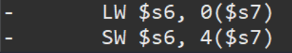
    
    Bolha inserida ao chegar na fase de Fetch para instrução `SW`:

    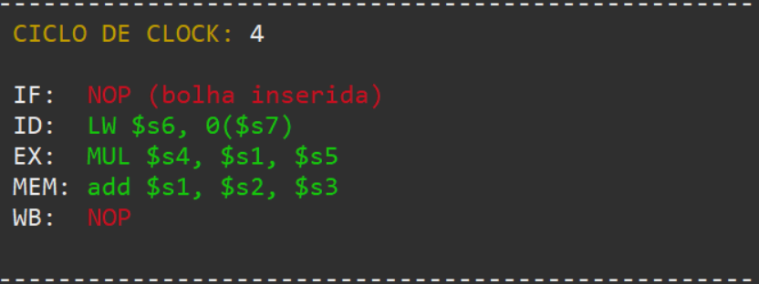

    Dessa forma, os dados do registrador `$s6` pode ser passado diretamente da **MEM para EX** quando `LW` passa pelo acesso à memória:

    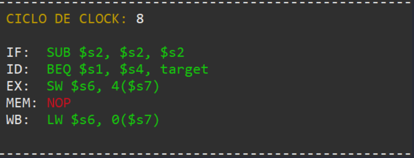

**Observação:**

Hazards Estruturais são tratados especialmente em situações onde temos umas instrução `MUL` passando pelo estágio de execution, já que devemos considerar seus 2 ciclos de execução e não permitir que instruções anteriores "invadam" algum componente já utilizado por outra instrução.
-- -
### Predição de Branch

Para otimização de ciclos de execução do Pipeline foi utilizada uma técnica de predição de Branch em que uma instrução de desvio condicional `BEQ` é prevista ainda no estágio de Decode. Em caso de uma predição com resultado *falso*, a instrução que segue na fase de **IF** é a instrução em sequência no contador de programa. Em caso de uma predição com resultado *verdadeiro*, o contador de programa é desviado para a instrução indicada pela label.

A predição é feita de maneira probabilística baseado em 4 estados que é descrito no código em forma de *ENUM*:

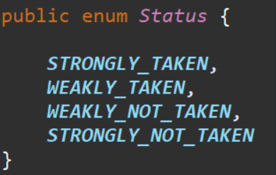

`STRONGLY_NOT_TAKEN`(25%),
`WEAKLY_NOT_TAKEN`(50%),
`WEAKLY_TAKEN`(75%),
`STRONGLY_TAKEN`(100%)

Os estados funcionam da seguinte forma:

- Inicialmente o Pipeline é inicializado com o estado de predição `STONGLY_NOT_TAKEN`, que indica um estado de probabilidade de 25% de desvio.

- A medida que uma instrução `BEQ` é executada, o resultado altera o estado de predição da seguinte forma: 

    Quando uma execução de desvio condicional resulta em *true*, o estado de predição altera para um estado acima. Em caso contrário, o estado altera para um estado abaixo.

- Em caso de conflito de resultado entre a predição e a execução real da instrução, as instruções colocadas no Pipeline após o `BEQ` são limpadas e o **IF** altera para o resultado correto.

**Exemplo de erro de predição:**

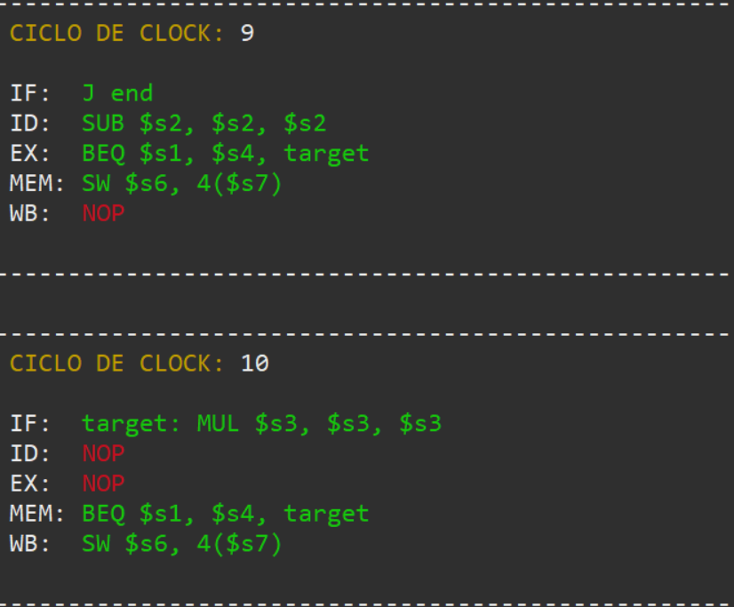
-- -
### Registradores e Memória

A simulação de de Registradores e Memória foi feita a partir do uso de 2 Arrays na classe Pipeline. Foram definidos **32 registradores** `($s0 - $s31)` e **40 posições de Memória**.

Para uma execução de Pipeline de forma **manual**, o usuário tem a opção de ver os dados armazenados atualmente nos registradores ou na memória, da seguinte forma:

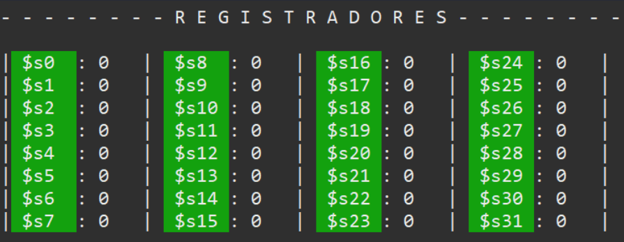

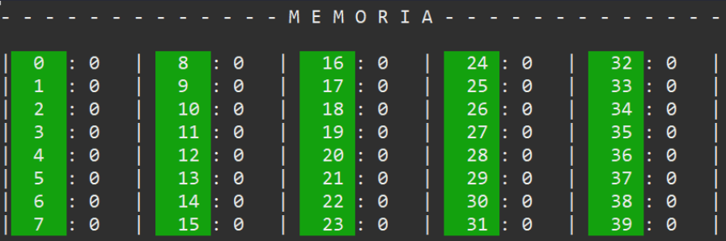
-- -
### Exceções Personalizadas

Foram implementadas exceções personalizadas para simular 2 tipos de erros que podem ocorrer durante a execução do programa:

1. `InstructionNameException`: exceção para quando uma instrução não atende um nome correto. (consultar instruções suportadas).

2. `LabelException`: exceção para quando uma label, chamada por um desvio, não é encontrada no programa.
-- -
### Testes

1. **Programa 1: Básico com Hazards**

    ```asm
    add $s1, $s2, $s3
    mul $s4, $s1, $s5
    lw $s6, 0($s7)
    sw $s6, 4($s7)
    beq $s1, $s4, target
    sub $s2, $s2, $s2
    j end
    target: mul $s3, $s3, $s3
    end: nop
    ```
    
    Resultados com **STALL:**

    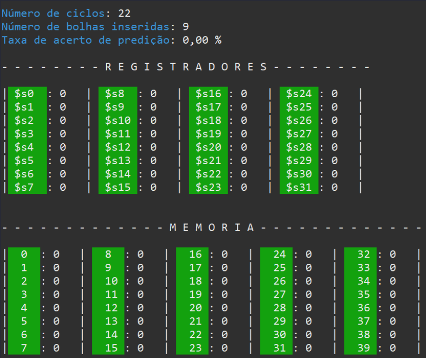

    Resultados com **FORWARDING:**

    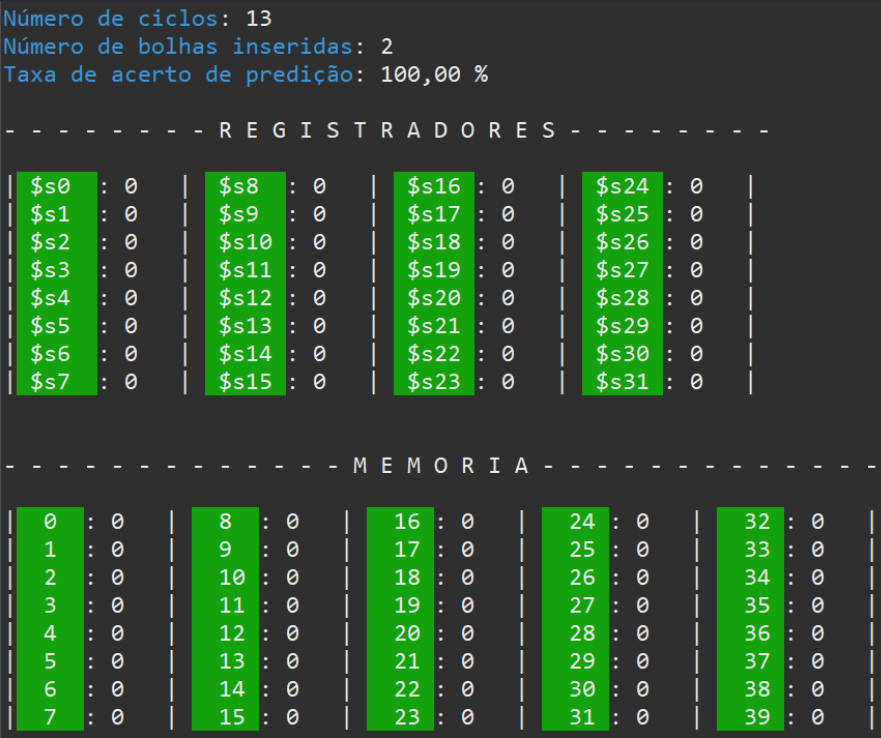
-- -
2. **Programa 2: Acesso intenso à Memória**

    ```asm
    lw $s1, 0($s0)
    lw $s2, 4($s0)
    mul $s3, $s1, $s2
    sw $s3, 8($s0)
    j end
    end: nop
    ```

    Resultados com **STALL:**

    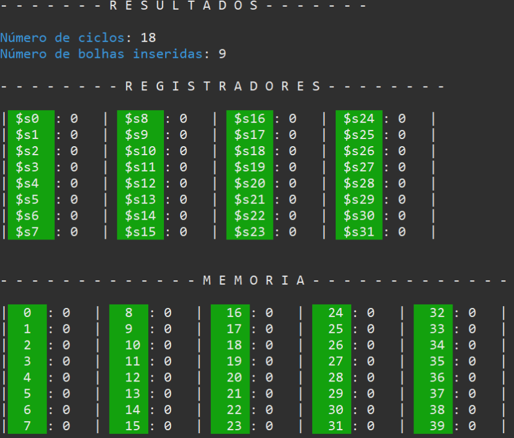

    Resultados com **FORWARDING:**

    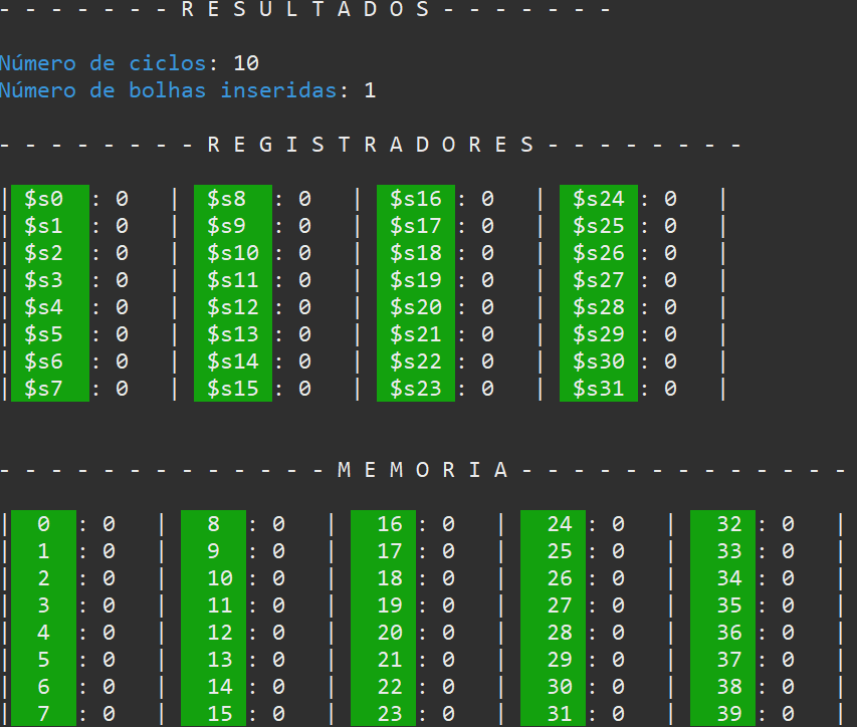
-- -
3. **Programa 3: Loop com Dependências**

    ```asm
    add $s0, $s0, $s1
    mul $s2, $s0, $s3
    sub $s4, $s4, $s2
    beq $s4, $s0, loop
    j end
    loop: add $s1, $s1, $s1
    j start
    end: nop
    start: nop
    ```

    Resultados com **STALL:**

    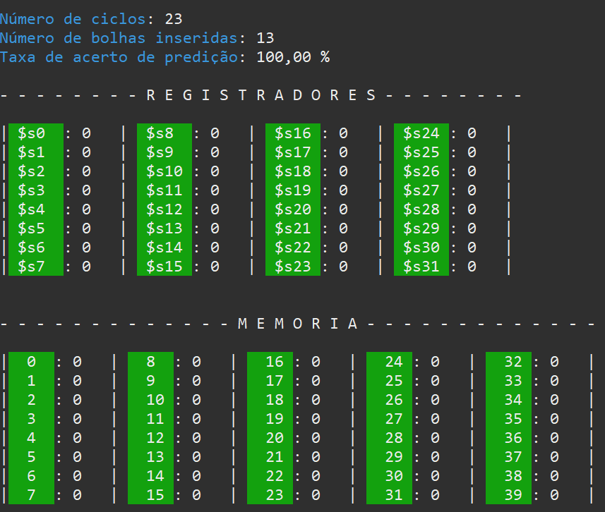

    Resultados com **FORWARDING:**

    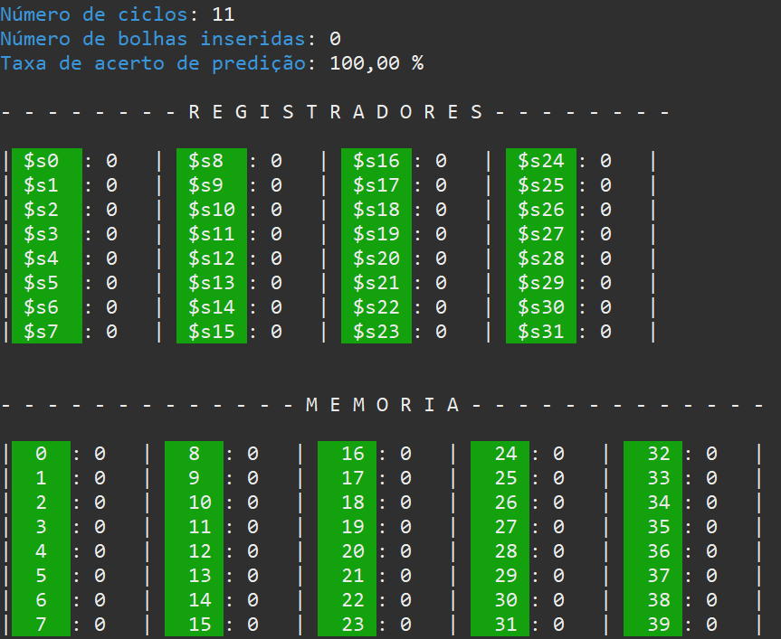
-- -